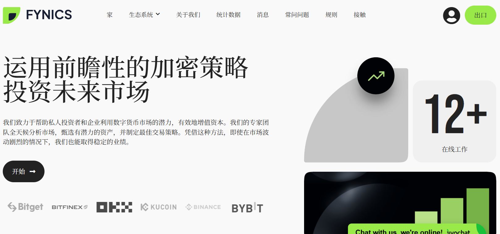
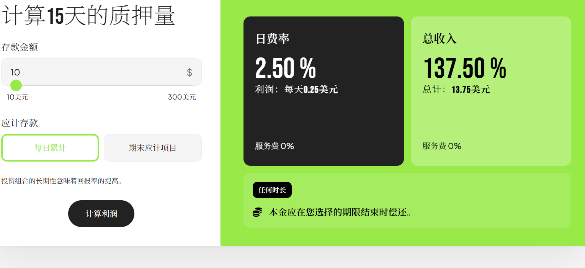

:::tip
## HM指数：4️⃣.0️⃣5️⃣
HM指数是什么❓🤔    
### [点击我了解👈](/docs/Newcomers/hyip-hm)
:::

:::info

### 开始日期：2025 年 6 月 25 日
计划: 每天 2.5%，持续 15 天    
最低存款: 10美元   
最低支出: BTC 100 美元、ETH 50 美元、USDT.TRC20 50 美元、TRON (TRX) 1 美元、USDC.TRC20 50 美元、BNB.BEP20 10 美元、USDT.BEP20 1 美元、SHIB.BEP20 10 美元、BUSD.BEP20 1 美元、SOL.BEP20 10 美元、Polygon MATIC 10 美元、Polygon USDT 10 美元、LTC 10 美元、DOGE 5 美元、DASH 10 美元、BCH 10 美元、XRP 10 美元、TON 10 美元、USDT.TON20 10 美元、SOL 10 美元、USDT.SOL20 10 美元     
付款类型: 手动的     
支付系统: Bitcoin, Ethereum, Litecoin, DashCoin, BitcoinCash, Ripple, Dogecoin, Binance Coin, Shiba Inu, Ton   

[®️立即访问](https://fynics.com/?ref=fyn549955)
:::

### [®️立即访问](https://fynics.com/?ref=fyn549955)

