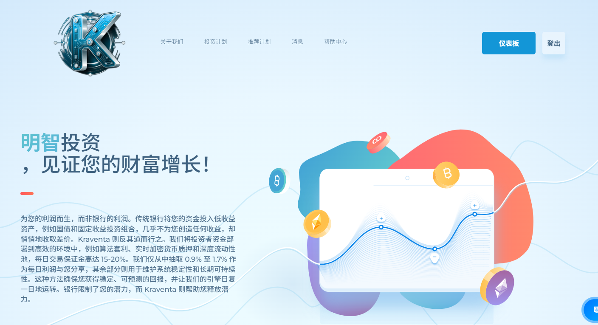
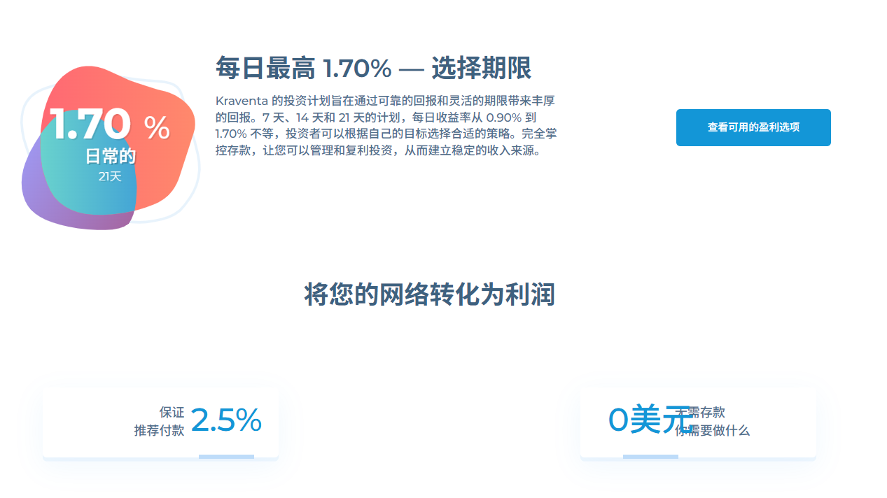

:::tip
## HM指数：4️⃣.2️⃣
HM指数是什么❓🤔    
### [点击我了解👈](/docs/Newcomers/hyip-hm)
:::

:::info

### 开始日期：2025年6月21日
计划: 0.90%；每日7天 - 1.25%；每日14天 - 1.70%；每日21天+返还100.00%本金      

最低存款: 25美元    

最低支出: 10美元          

付款类型: 手动的         

支付系统: Tether、Tron            

[®️立即访问](https://kraventa.com/?ref=kra549955)
:::

### 关于

### [®️立即访问](https://kraventa.com/?ref=kra549955)

