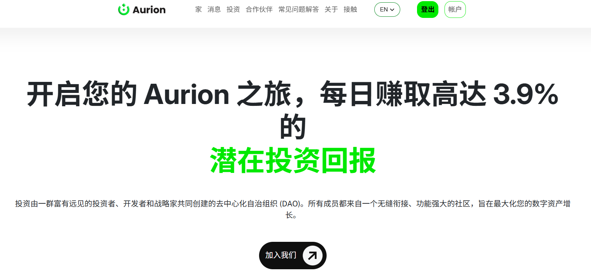
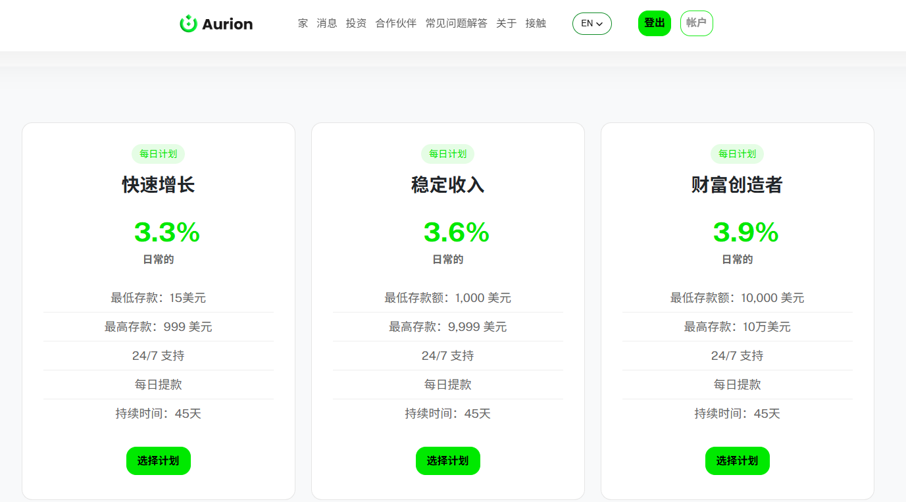

:::warning

### 诈骗日期：2025年6月27日 - 已实施16天

:::

:::tip
## HM指数：6️⃣.1️⃣1️⃣
HM指数是什么❓🤔    
### [点击我了解👈](/docs/Newcomers/hyip-hm)
:::

:::info

### 开始日期：2025年6月11日
计划: 每天 3.3%，持续 45 天        

最低存款: 15美元    

最低支出: 5美元        

付款类型: 手动              

支付系统: Bitcoin, Ethereum, Litecoin, Dogecoin, Tether, Tron                     

#### [®️立即访问](http://aurion.investments/?ref=aur549955)
:::

### 关于
Aurion DAO 正式在全球上线   
Aurion DAO 正式在全球发布，开启去中心化投资解决方案新纪元  

2025 年 6 月 11 日——Aurion 是一个去中心化自治组织 (DAO)，由一群具有前瞻性思维的投资者、开发者和战略家创立，致力于通过区块链技术和社区治理彻底改变投资策略。经过数月的密集开发和战略筹备，Aurion 今天自豪地宣布正式在全球发布。备受期待的 Aurion 平台和网站的发布，标志着通过区块链技术和去中心化治理实现投资机会民主化的重要里程碑。   

去中心化金融的新标准    
Aurion DAO 建立在透明度、社区驱动的决策和可访问性的原则之上。通过利用去中心化治理的力量，Aurion 使其成员能够参与投资策略、资产管理和利润分享，而无需面对中心化金融机构的传统障碍。  

### [®️立即访问](http://aurion.investments/?ref=aur549955)

