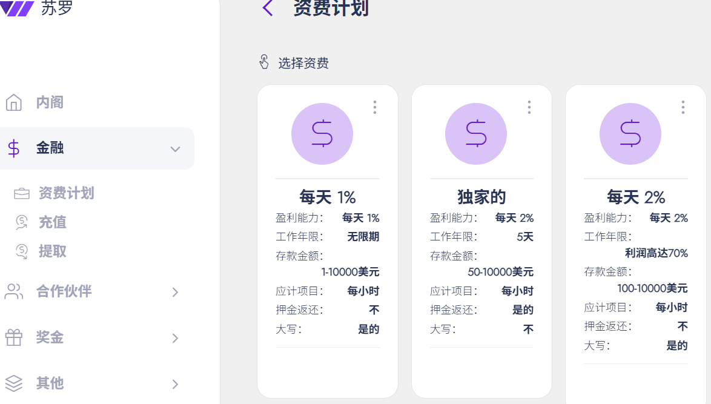

:::warning

### 诈骗日期：2025 年 6 月 30 日 - 已实施 64 天   

:::

:::tip
## HM指数：5️⃣.2️⃣7️⃣
HM指数是什么❓🤔    
### [点击我了解👈](/docs/Newcomers/hyip-hm)
:::

:::info

### 开始时间:2025年4月27日
计划: 每日 1% - 20%；每小时收益；包含押金             

最低存款: 10美元       

最低支出: 0.1 美元                  

付款类型: 立即的                     

支付系统: Payeer, Bitcoin, Ethereum, Litecoin, Dogecoin, Tether, Yandex money, ePayCore                       

[®️立即访问](https://suro.work/i/9728)
:::

### 关于
现代人工智能技术正在革新许多行业，加密货币世界也不例外。SURO 利用人工智能分析海量数据，从而预测市场趋势、降低风险并优化投资策略。SURO 的主要服务之一是自动交易，人工智能可以代表用户独立进行交易。该平台旨在在最佳时机开仓和平仓，从而显著提高成功率。因此，SURO 平台不仅仅是一个赚钱的工具，更是加密货币世界的合作伙伴，帮助用户理解并克服这个充满刺激但风险重重的市场的复杂性。

### [®️立即访问](https://suro.work/i/9728)

