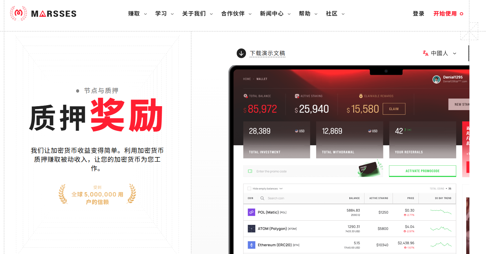
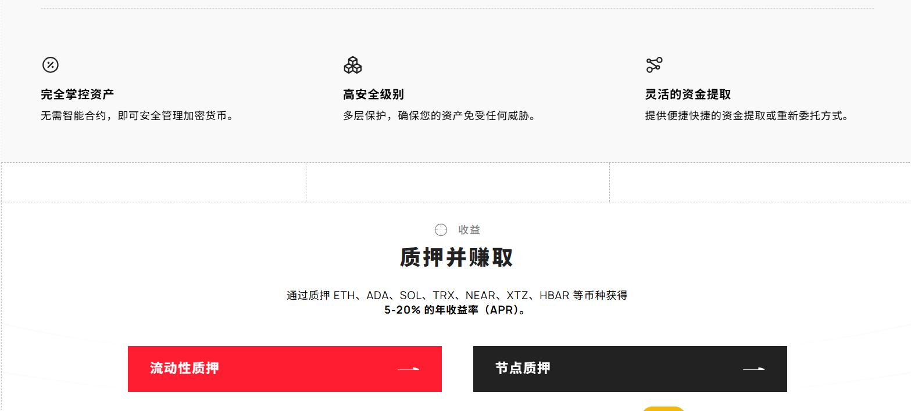

:::note
### 博主投入:💲2️⃣5️⃣
:::

:::tip
## HM指数：5️⃣.7️⃣6️⃣
HM指数是什么❓🤔    
### [点击我了解👈](/docs/Newcomers/hyip-hm)
:::

:::info

### 2022年3月12日
计划: 303 至 386 天内每天 0.48% 至 0.85%；365 天后 230%         

最低存款: 25美元    

最低支出: TRX — 7 美元、BitcoinCash — 20 美元、Dash — 5 美元、狗狗币 — 5 美元、莱特币 — 6 美元、比特币 — 30 美元、Tether (Polygon) — 3 美元、Tether (ERC20) — 25 美元、POL (Matic) — 3 美元、以太坊 (ERC20) — 25 美元、Solana (BEP20) — 3 美元、Shiba Inu (BEP20) — 6 美元、Tether (BEP20) — 3 美元、BNB (BEP20) — 3 美元、Tether (TRC20) — 10 美元、USD Coin (TRC20) — 10 美元、XRP — 10 美元、USD Coin (ERC20) — 25 美元、Coin98 (BEP20) — 3 美元、Cordano (BEP20) — 3 美元、POL (BEP20) — 3 美元、Polkadot (BEP20) — 3 美元、Avalanche (BEP20) — 3 美元、Chainlink（BEP20）——3 美元、NEAR 协议（BEP20）——3 美元、TWT（BEP20）——3 美元、USD Coin（BEP20）——3 美元、Uniswap（BEP20）——3 美元、SushiSwap（BEP20）——3 美元、ATOM（BEP20）——3 美元、SOL——6 美元、TON——5 美元、USDT SOL——3 美元、USDT TON——3 美元。           

付款类型: 手动（最多 72 小时）           

支付系统: Bitcoin, Ethereum, DashCoin, BitcoinCash, Dogecoin, Tether, Tron, Shiba Inu, Ton, Solana                

[®️立即访问](https://marsses.com/?ref=mar549955)
:::

### 关于

### [®️立即访问](https://marsses.com/?ref=mar549955)

