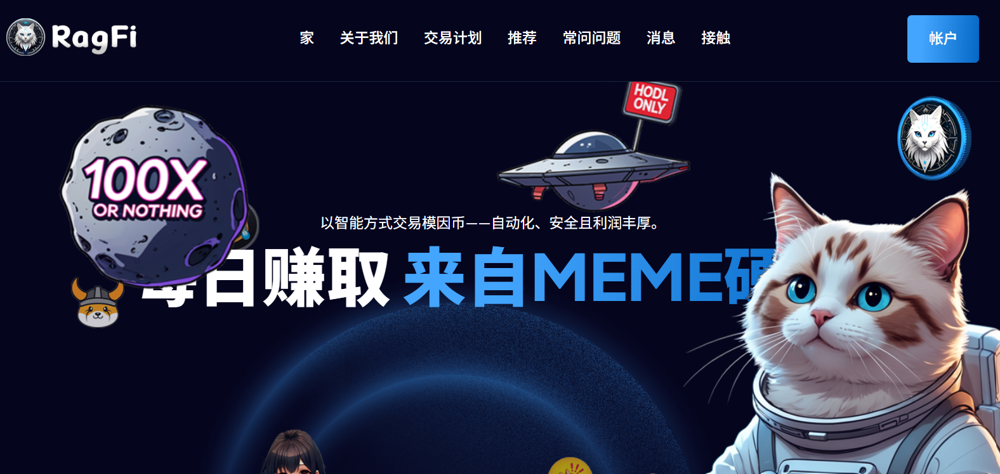
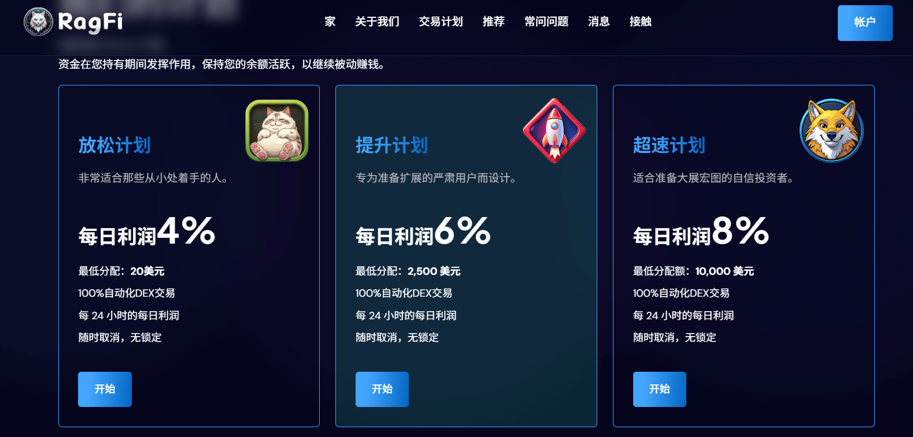

:::note
### 博主投入:💲2️⃣0️⃣
:::

:::tip
## HM指数：5️⃣.8️⃣4️⃣
HM指数是什么❓🤔    
### [点击我了解👈](/docs/Newcomers/hyip-hm)
:::

:::info

### 2025 年 6 月 7 日
计划: 每天 4% - 8% 永久                

最低存款: 20美元       

最低支出: 5美元                    

付款类型: 手动（最多 48 小时）                        

支付系统: Bitcoin, Ethereum, Litecoin, Dogecoin, Tether, Tron, Binance Coin                           

[®️立即访问](https://ragfi.io/ref/rag549955)
:::

### 关于
我们让 memecoin 交易盈利成为可能——无需图表、研究或压力。您无需追逐新币发行、分析代币或担心市场波动。只需选择一个方案，我们的系统将为您完成繁重的工作。我们的人工智能机器人全天候扫描去中心化交易所，寻找真正的交易机会，同时过滤掉骗局和山寨币。每笔交易都以数据、逻辑和久经考验的算法为后盾，而非炒作。代码背后是一支由经验丰富的开发者和建设者组成的真正团队，他们经历了每一个周期和每一次市场波动。结合智能自动化和丰富的经验，我们能够提供稳定的每日利润——无需猜测，无需恐慌，只看结果。

### [®️立即访问](https://ragfi.io/ref/rag549955)

